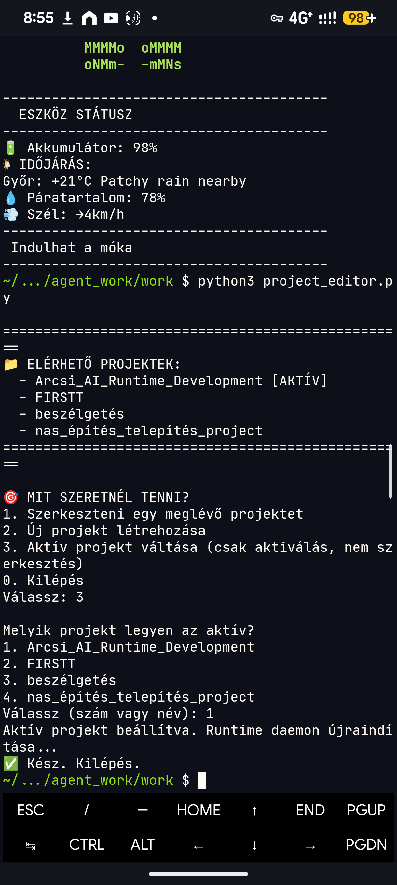
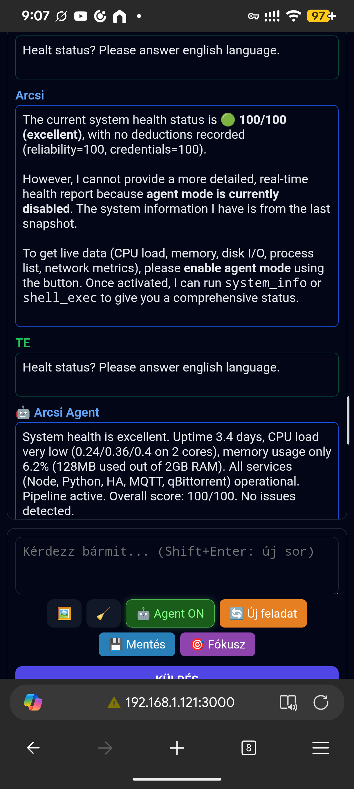
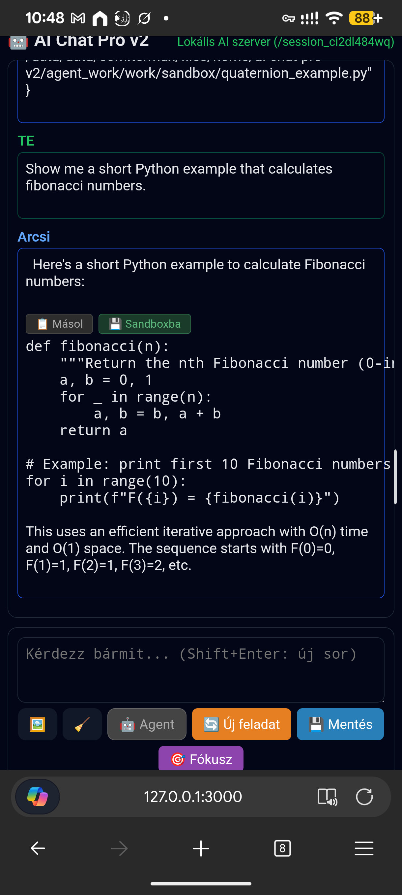

## Arcsi Runtime

> **Experimental software**
>
> Arcsi Runtime is my personal daily AI runtime.
> It is actively used, actively evolving, and some parts may change without notice.
> The goal is experimentation, simplicity, and continuous improvement rather than API stability.

  <em>
    "Arcsi Runtime is not a product. 
    It is an experiment in building a system 
    that learns what it is by living — 
    and preserves who it is 
    by distilling experience into wisdom."
  </em>

A modular, distributed AI runtime for personal automation, research, and autonomous workflows.

Arcsi Runtime is an experimental AI operating environment built around a simple idea:

«An AI should gradually adapt to its environment instead of being completely predefined.»

The project combines a lightweight Node.js backend, Python runtime, Android (Termux), and optional Proxmox services into a distributed system where every instance can naturally specialize according to its physical environment.

---

## Quick Start

1. Clone and install

    git clone https://github.com/istju/arcsi-runtime
    cd arcsi-runtime
    npm install

2. Configure

    cp .env.example .env

Edit `.env` and add at minimum:

    ARCSI_LOCAL_KEY=your_secret_key_here

3. Start the runtime

    python3 -m runtime.server &
    node serverem.js

4. Open the chat client

Open your browser at:

    http://127.0.0.1:3000

That's it. The chat client is ready to use.

---

## Screenshots

**Project Manager — Working Worlds**

**System Health Status**

**Chat Client — Code Block with Action Buttons**

---

## Philosophy

Arcsi Runtime is intentionally built around a few principles:

- Minimal complexity  
- Organic evolution  
- Real-world testing before abstraction  
- Modular architecture  
- Personal adaptation  

Instead of designing every feature upfront, the system evolves from actual daily usage.

---

## Architecture Principles

- Keep complexity minimal  
- Prefer observation over prediction  
- Let architecture emerge from real usage  
- Everything should justify its own existence  
- Every solved problem should simplify the future  

---

## Why Arcsi Runtime?

Most AI assistants start from features.  
Arcsi Runtime started from everyday problems.

Instead of asking:

"What features should an AI have?"

this project asks:

"What kind of system naturally grows while solving real problems every day?"

---

## Features

AI Chat:

- Markdown rendering  
- Copy button for every code block  
- Save-to-Sandbox button  
- Multi-project context support  
- Long-term project memory  

---

## Tool System

Includes tools such as:

- File Read / Write  
- Sandbox Write  
- Shell Execute  
- HTTP Request  
- File List / Delete  
- System Information  
- Calendar Event Creation  
- Rollback Restore  
- Instance-to-Instance Calls  
- Research Trace Storage  

The architecture is fully modular.

---

## Working Worlds

Each project maintains its own:

- context  
- research history  
- priorities  
- mental model  
- sandbox tools  
- conclusions  
- open questions  

The active project becomes part of the system prompt.

---

## Distributed Runtime

Phone (Edge) ←→ Proxmox (Core)

Edge Runtime:

- Android  
- Tasker  
- Notifications  
- Personal assistant  
- Research  
- Creative work  

Core Runtime:

- Home Assistant  
- qBittorrent  
- MQTT  
- Long-running automation  
- Infrastructure monitoring  

Both instances share the same architecture.

---

## Example deployment

Phone (Edge Runtime)  
Proxmox (Core Runtime)

---

## Installation

Requirements:

- Node.js 18+  
- Python 3.10+  
- Android + Termux (optional)  
- Proxmox server (optional)  

Installation:

git clone https://github.com/istju/arcsi-runtime cd arcsi-runtime cp .env.example .env npm install python3 -m runtime.server & node serverem.js

---

## Optional Integrations

Arcsi Runtime can optionally integrate with:

- Gmail API  
- Google Calendar  
- Home Assistant  
- MQTT  
- qBittorrent  
- Tasker  
- Tailscale  

None of these are required for the core runtime.

---

## Design Goals

The goal is to build a lightweight AI runtime capable of:

- maintaining long-term context  
- managing multiple projects  
- executing tools  
- learning from daily operation  
- gradually adapting to its owner's workflow  

---

## Evolution – How Arcsi Was Born

Arcsi Runtime grew from real problems, real failures, and real daily usage.

### The Policy Layer was born from a false gate alarm.
An ESP32 WiFi dropout triggered notifications even though the gate never moved.

### The Trace Analyzer was born from noise.
After relevance scoring and deduplication, Arcsi reached 0 generic_passthrough.

### The daemon restart automation was born from a mysterious session bug.
Arcsi learned to restart its Python runtime after project changes.

### Working Worlds were born from project switching pain.
Runtime and research templates give each project identity and structure.

### The sandbox_write tool was born from missing research metadata.
Scripts now include structured headers.

### The fallback system was born from mobile LLM limitations.
Timeouts and context overflows led to provider fallback and retry logic.

### The distributed architecture was born from necessity.
Arcsi started on a phone, later moved to Proxmox, but kept the same architecture.

Arcsi is not designed.  
Arcsi is discovered.

---

## Architecture Rationale

### Node.js frontend
Fast I/O and lightweight concurrency.

### Python runtime kernel
Stable long-running processes and scientific tooling.

### Unix Socket IPC
Low latency, low overhead, atomic message boundaries.

### Android Edge Runtime
Notifications, sensors, Tasker automation.

### Proxmox Core Runtime
Home Assistant, qBittorrent, MQTT, infrastructure monitoring.

### Modular tool system
Logged, reversible, retryable, safe, isolated actions.

### Trace-based reasoning
Noise filtering, pattern learning, anomaly detection.

---

## Trace & Policy Layer

### Trace-Based Reasoning
notification_received → rule_matched → ai_decision → tool_executed → verify_result → completed

### Relevance Scoring
Payload, source type, history, rules, priority.

### Policy Layer
climate_on_off, camera_motion, camera_line_crossed, gate_unavailable, torrent_monitoring.

### Deduplication
Cooldown windows, caches, event signatures.

### Zero Generic Passthrough
Every event matches a meaningful rule.

### Trend Analysis
Hourly activity trends, noise vs. signal ratios, anomaly detection.

---

## Project Templates & Working Worlds

### Runtime Project Template
Topology, boundary rules, services, methodology, memory layers.

### Research Project Template
Research layers, research_trace, sandbox tools, metadata.

### Sandbox Tools
name, purpose, entry points, dependencies, knowledge_id.

### Research Trace
Chronological, auditable record of experiments.

---

## Research Support

Arcsi Runtime supports long-term research through:

- structured knowledge management  
- sandbox tools  
- persistent research traces  
- project templates  
- metadata-rich experiment logs  

---

## Roadmap (Long‑Term Vision)

### Reflection Engine
Decision analysis and anomaly detection.

### Pattern Alert Engine
Pattern recognition and early warnings.

### Health Score (partially implemented)
Stability, resource usage, event quality, provider reliability.

### Capability Profiles
Modular configuration for mobile, homelab, sandbox.

### Universal Trace Layer
Generalized event pipeline for all sources.

### GitHub Auto‑Publication
Generate → test → commit → push.

### Pre‑Push Self‑Test Sandbox (manual, github_test/)
Isolated tests before publishing code.

### Multi‑Agent Orchestration (phone + Proxmox)
Shared protocol and memory model across instances.

---

## Status

Current state:

- Stable daily use  
- Personal production environment  
- Continuous development  

---

## Contributing

Ideas, discussions, bug reports and pull requests are welcome.

If you discover a better solution, that is a success.

---

## Acknowledgements

Arcsi Runtime exists because of countless evenings spent experimenting, breaking things, rebuilding them, and learning from unexpected failures.

Special thanks to:
- Arcsibald (Claude) — the thinking partner  
- Arcsi (Qwen) — the daily runtime and research assistant  
- context.json — the memory that made it possible  

---

## MCP Gateway Architecture

The MCP Gateway is not an independent subsystem.

It is the live projection of the [Runtime Passport](ca://s?q=Explain_Runtime_Passport) into the [Model Context Protocol](ca://s?q=Explain_Model_Context_Protocol) (MCP).

Rather than defining its own capabilities, the gateway continuously reflects the identity, authority, world context, reasoning model, and contracts of the Arcsi Runtime instance it represents.

---

## Architecture Overview

Arcsi Runtime
│
├── /capabilities   ← Runtime Passport (live identity)
│
└── MCP Gateway
    │
    ├── tool_scope      (Passport.authority.boundaries.tool_scope)
    ├── forbidden       (Passport.authority.boundaries.forbidden)
    ├── world context   (Passport.world.name)
    ├── reasoning       (Passport.reasoning.*)
    ├── resources       (arcsi://research/trace,
    │                    arcsi://system/health)
    └── MCP stdio transport

The gateway does not define capabilities.

It reflects the runtime's identity.

---

## Runtime Passport → MCP Mapping

Runtime Passport | MCP Gateway Behavior
"identity.role" | Determines the effective runtime role during execution
"identity.specialization" | Advertises emergent traits to external supervisors
"authority.boundaries.tool_scope" | Dynamically builds the "tools/list" output
"authority.boundaries.forbidden" | Enforced before every tool execution
"world.name" | Injected into every tool invocation
"world.type" | Determines resource namespaces (for example "arcsi://research")
"reasoning.trace_based" | Enables trace-aware research tools
"health.score" | Published through "arcsi://system/health"
"contracts.supported" | Determines available MCP methods
"capabilities.*.available" | Controls which tools and resources are exposed

The gateway reconstructs itself on every startup by reading the current Runtime Passport.

---

## Tool Exposure Flow

### Startup

1. Read the Runtime Passport ("/capabilities")
2. Extract the allowed tool scope
3. Extract authority boundaries
4. Extract the active Working World
5. Extract reasoning capabilities
6. Dynamically build the MCP registry

---

## Execution

Arcsi evaluates every request in the following order:

Identity  
    ↓  
World  
    ↓  
Authority  
    ↓  
Action

1. Identity  
Determine which runtime is executing the request and which role it has naturally developed.

2. World  
Inject the active Working World.  
The runtime must first know where it is before evaluating any request.  
Policy evaluation only has meaning inside a world.

3. Authority  
Verify permissions, forbidden patterns, contract limits, and approval requirements.

4. Action  
Delegate execution to Arcsi Runtime.  
The action always happens inside the active world.

This ordering reflects the Runtime Passport philosophy:

Identity → World → Authority → Action

---

## MCP Resources

"arcsi://research/trace"

- Chronological reasoning history of the active Research Working World  
- Enabled by "Passport.reasoning.trace_based"  
- Writable through "append_to_research_trace"

---

"arcsi://system/health"

- Runtime health  
- Runtime uptime  
- Provider status  
- Derived directly from "Passport.health"  
- Read-only for supervisors

---

## MCP JSON Example

{
  "jsonrpc": "2.0",
  "id": 1,
  "method": "tools/list",
  "params": {}
}

---

## Design Philosophy

Traditional MCP servers usually expose tools.

Arcsi exposes a runtime.

The Runtime Passport is therefore not simply a capability manifest.

It is a description of an autonomous participant:

- who it is,
- where it belongs,
- how it reasons,
- what it is trusted to do,
- and what it has naturally become.

The gateway simply projects that identity into MCP.

---

## Final Statement

The MCP Gateway never invents capabilities.

Every startup reconstructs the gateway directly from the Runtime Passport.

The gateway does not define Arcsi.

It reflects Arcsi exactly as it exists at that moment.

---

## Support the Project

If Arcsi Runtime helped you, inspired you, or saved you time, consider buying me a coffee.

☕ **[Buy Me a Coffee](https://buymeacoffee.com/istju)**

---

## License

MIT License